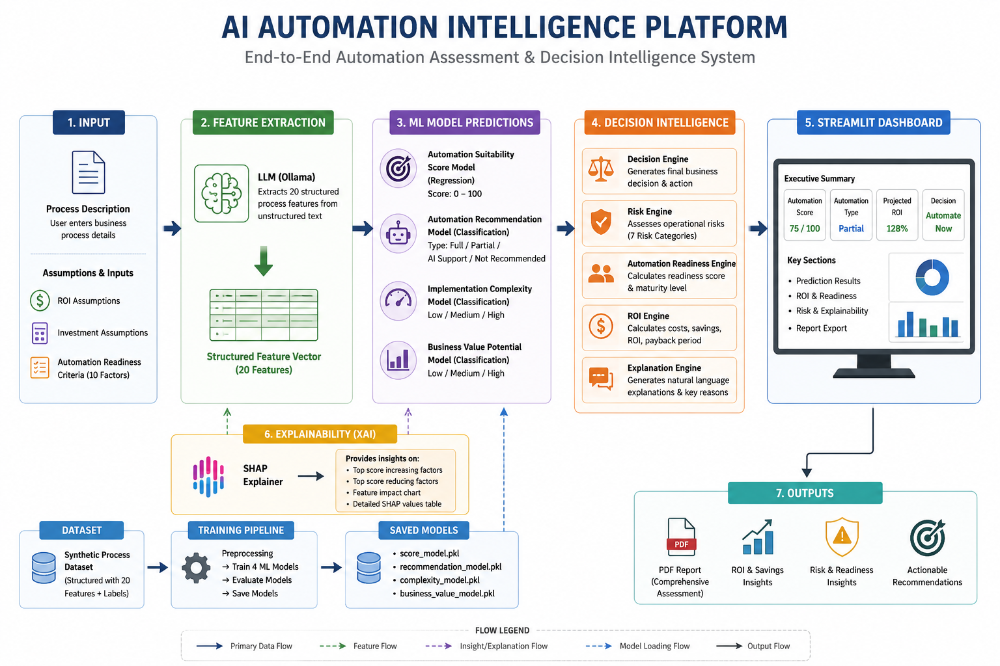
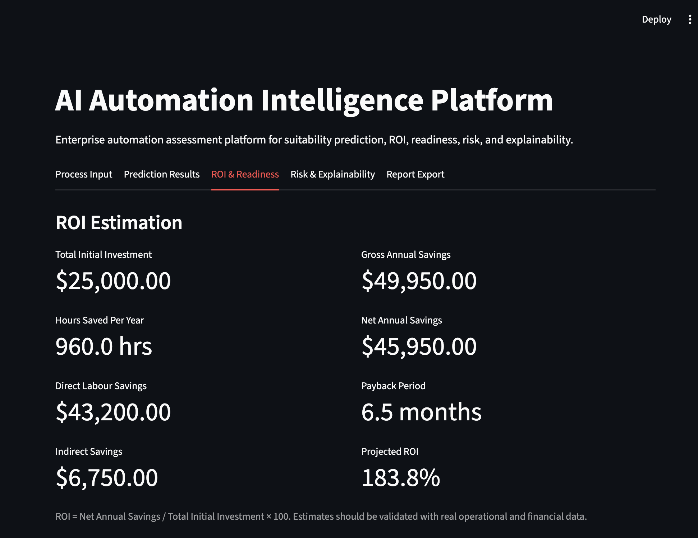
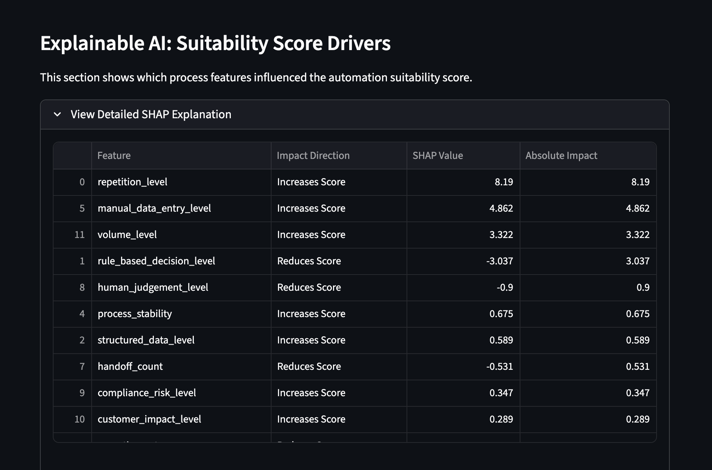
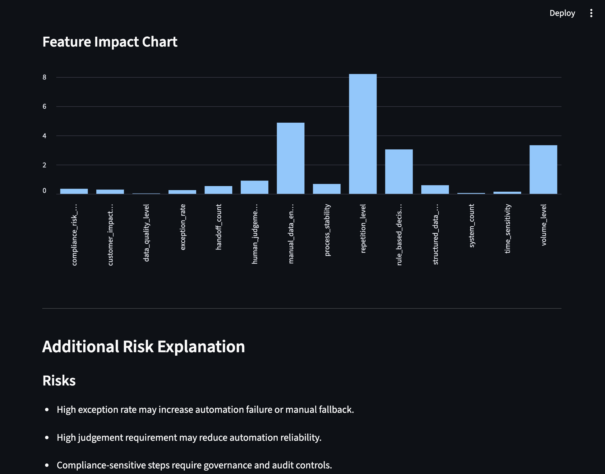

# AI Automation Intelligence Platform
AI-powered enterprise automation assessment platform that evaluates automation suitability, ROI, operational risk, and automation readiness using Machine Learning and LLM-based feature extraction.

Most organisations assess automation opportunities manually using workshops, spreadsheets, and consultant interviews. This project explores how AI and Machine Learning can assist in identifying automation opportunities, estimating ROI, assessing operational risks, and improving enterprise automation decision-making.

## Features

- LLM-based process feature extraction
- Automation suitability prediction
- Automation recommendation engine
- ROI estimation engine
- Enterprise automation readiness assessment
- Operational risk assessment
- SHAP explainable AI
- PDF automation assessment reports
- Streamlit enterprise dashboard

## Workflow Architecture



## Tech Stack

- Python
- Streamlit
- Scikit-learn
- SHAP
- Ollama
- Pandas
- ReportLab
- Joblib

## Final Project Structure

```text
automation-intelligence-ml/
│
├── app/
│   └── streamlit_app.py
│
├── assets/
│   └── Workflow.png
│
├── data/
│   └── synthetic_process_dataset.csv
│
├── models/
│   ├── business_value_model.pkl
│   ├── complexity_model.pkl
│   ├── recommendation_model.pkl
│   └── score_model.pkl
│
├── src/
│   ├── automation_readiness_engine.py
│   ├── decision_engine.py
│   ├── explanation_engine.py
│   ├── feature_extraction.py
│   ├── report_generator.py
│   ├── risk_engine.py
│   ├── roi_engine.py
│   ├── shap_explainer.py
│   └── train_model.py
│
├── .gitignore
├── LICENSE
├── README.md
└── requirements.txt
```

## Installation

### Clone repository

```bash
git clone https://github.com/yourusername/automation-intelligence-ml.git
```

### Create virtual environment

```bash
python -m venv venv
```

### Activate environment

Mac/Linux:

```bash
source venv/bin/activate
```

Windows:

```bash
venv\Scripts\activate
```

### Install requirements

```bash
pip install -r requirements.txt
```

### Run Streamlit app

```bash
streamlit run app/streamlit_app.py
```

## Dashboard Preview




